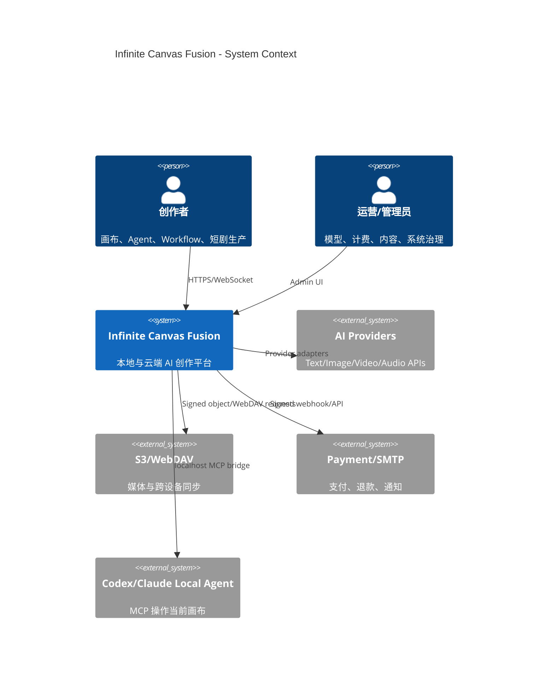
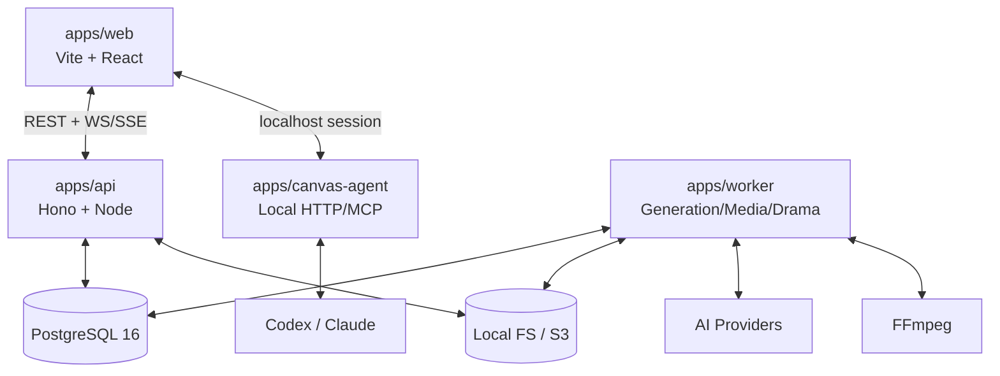
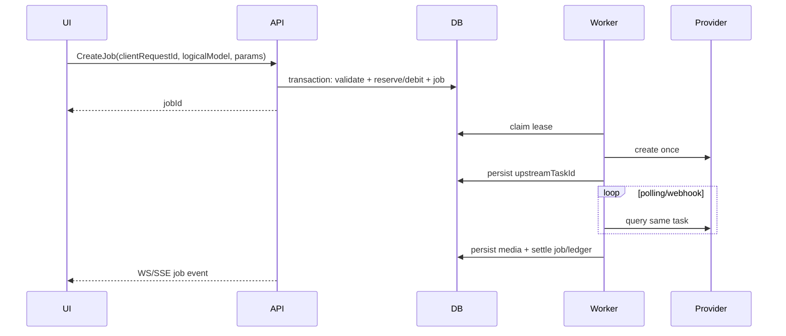

# Infinite Canvas Fusion 产品架构方案

> 状态：Implementation Active（R0 complete，R1 in progress）
> 基线：`infinite-canvas@ed013e8`、`z3cz@31542084`、`VOZEB-PRO@f216abf`  
> 日期：2026-08-27  
> 决策：以 infinite-canvas 为地基；用户已确认持有 VOZEB-PRO 授权，可直接参考并迁移实现逻辑。

## 1. 架构目标

打造一套同时支持个人本地创作与团队云端生产的 AI 多模态创作平台，覆盖：

- 无限画布、可执行 Workflow、Creative Studio、统一创作 Agent；
- 文本、图片、视频、音频生成与持久任务；
- 本地 Agent/MCP、Skills、插件节点；
- 素材库、短剧生产线、作品发布与社区；
- 多模型渠道、逻辑模型路由、积分计费、支付退款与运营后台；
- 离线单机、Docker 私有部署与可扩展云部署。

### 1.1 质量目标

| 维度 | 目标 |
|---|---|
| 兼容性 | infinite-canvas `version: 3` 项目无损导入；未知插件节点可 round-trip |
| 可靠性 | 已受理生成任务刷新页面/重启实例后继续；重复请求不重复调用上游或扣费 |
| 安全性 | Server mode 密钥永不下发浏览器；远程插件不在主 Window Realm 执行 |
| 可部署性 | 单机 Docker Compose 为第一优先；云平台能力均位于 adapter 后 |
| 可扩展性 | 新模型、新节点、新存储、新支付渠道通过稳定 contract 接入 |
| 可测试性 | domain state machine、migration、权限、计费与任务恢复必须有自动化测试 |

### 1.2 非目标

- 不把三套 UI 逐页拼接成巨型 SPA。
- 不让 Canvas 的视觉连线自动等同可执行 DAG。
- 不在第一阶段引入微服务、Kafka、Redis 等非必要基础设施。
- 不为迁就 Cloudflare 而牺牲自托管 Node/PostgreSQL 主路径。

## 2. 核心架构决策

### ADR-001：保留 Vite React 前端，服务端独立化

- `infinite-canvas/web` 保持 Vite + React 19 地基，逐步迁入 pnpm workspace。
- 新建 Hono TypeScript API；Node 运行时为标准实现，Cloudflare 为可选 adapter。
- VOZEB Next.js Route Handler 中的业务逻辑迁入 domain/service/repository，不直接复制页面路由耦合。

### ADR-002：模块化单体 + 独立 Worker

第一阶段采用三进程：`web`、`api`、`worker`。API 内部按领域模块化，共用 PostgreSQL；生成和媒体持久化由 Worker 执行。达到明确独立扩缩容需求后才拆服务。

### ADR-003：Local-first 与 Server Workspace 双模式

- **Local mode**：画布、素材、配置保存在 localForage；用户可直连自有模型与 WebDAV。
- **Server mode**：账号、团队、协作、服务端密钥、持久任务、计费和治理启用。
- 同一 `CanvasDocument` contract，不维护两套 UI；通过 repository/provider adapter 切换。

### ADR-004：Canvas 与 Workflow 分离，通过 Compile 连接

- `CanvasDocument` 是自由布局创作数据，可包含注释、未连接节点、视觉连接。
- `WorkflowDefinition` 是强类型可执行图，必须通过 schema、port、cycle、credential 校验。
- 用户显式“发布为 Workflow”，编译器输出 definition、warning/error 和 source mapping。

### ADR-005：PostgreSQL 同时承载事务数据与任务租约

复用 VOZEB 的 transaction/lease/heartbeat 和 z3cz 的 durable execution 思路，使用 `FOR UPDATE SKIP LOCKED` 认领任务。初期不引入独立 MQ；事件通知使用 WebSocket/SSE，Outbox 保证提交后投递。

### ADR-006：媒体为不可变 Asset，业务只保存引用

Blob 落 localForage、本地文件或 S3-compatible storage；业务记录只保存 `AssetRef`。去重以 content hash 为辅，访问使用鉴权 API/短期 signed URL，删除必须通过引用保护。

### ADR-007：插件采用 Capability Sandbox

远程插件必须包含 manifest、版本、integrity/signature、权限声明；默认在 sandboxed iframe/Worker 中运行，通过 message RPC 调用 host capability。可信内置插件可编译入主包，但仍遵循相同 API。

## 3. 系统上下文



## 4. 容器架构



### 4.1 目标仓库结构

```text
apps/
  web/                 infinite-canvas UI 地基
  api/                 HTTP、WebSocket、鉴权、领域 application services
  worker/              任务认领、上游轮询、媒体持久化、短剧合成
  canvas-agent/        由 infinite-canvas/canvas-agent 迁入
  docs/                产品和运维文档
packages/
  contracts/           跨端 DTO、events、schema、错误码
  canvas-core/         Canvas reducer、geometry、migration、compiler
  plugin-sdk/          manifest、capability、RPC、sandbox host
  workflow-runtime/    DAG validate/schedule/execute/resume
  model-gateway/       channel/protocol/logical model/provider adapter
  media/               AssetRef、blob store、signed access、variant
  auth/                session、RBAC、MFA、encryption primitives
  database/            schema、migration、repositories、outbox
  ui/                  共享设计 tokens/基础组件，禁止放领域状态
infra/
  docker/              Compose、Nginx/Caddy、healthcheck
  scripts/             install、backup、restore、release checks
```

## 5. 前端组件边界

| Surface | 职责 | 状态来源 |
|---|---|---|
| Canvas Shell | 节点编辑、连线、图片编辑、插件节点 | Canvas repository + UI store |
| Workflow View | typed ports、校验、执行、timeline | Workflow API + execution events |
| Creative Studio | 按媒体/版本浏览同一项目成果 | Assets + node output projection |
| Agent Panel | 对话、Skill、planning、结构化 operations | Agent run/events |
| Drama Studio | 剧本、角色、场景、分镜、配音、字幕、合成 | Drama domain APIs |
| Library | 素材、提示词、生成历史、版本 | Asset/Prompt services |
| Community | 草稿、审核、发布、互动 | Publication/Governance services |
| Admin | 用户、模型、任务、财务、内容、审计 | Admin-scoped APIs |

前端组件禁止直接访问数据库、支付接口或 Server mode 上游模型。所有 Canvas 写入统一转换为 `CanvasOperation[]`，UI、Agent、插件和协作不得绕过 reducer。

Creative Studio 的实现遵守以下 projection contract：`CanvasProject` 始终是项目数据唯一真源，Studio 只读投影节点的文本、图片、视频和音频输出，不维护第二份可写项目状态；Workspace Asset 与 Generation Job AssetRef 作为带 `workspace_asset` / `generation_job` 来源标记的补充成果展示，不推断其归属当前 Project。Canvas 与 Studio 通过同一 Project ID 切换，返回 Canvas 时可用 `focusNode` 定位来源节点，因此切换视图不会改变节点、连线或 revision。

## 6. 领域模块

### 6.1 Identity & Workspace

用户、Session、MFA、组织、成员、角色、邀请、账户注销。RBAC 至少包含 `owner/admin/editor/viewer/operator`；资源鉴权必须同时校验 tenant 与 resource ownership。

### 6.2 Canvas

核心聚合：`Project -> CanvasDocument -> Node/Connection/AssistantSession`。保存采用 snapshot + patch log，`mutationId` 幂等，`baseRevision` 乐观并发。local repository 与 cloud repository 实现同一接口。

### 6.3 Workflow

核心聚合：`WorkflowDefinition -> Execution -> NodeExecution -> Event`。Runtime 负责拓扑分层、typed value 传递、step retry、sleep/event wait、cancel、resume。Cloudflare durable step 仅为 adapter。

### 6.4 Creative Runtime & Agent

统一文本/媒体创作会话，Agent Run 执行 planning、Skill policy、tool call、generation subtask 和 Canvas operations。内部 planning rationale 不进入面向用户的生成对话历史。

### 6.5 Model Gateway

采用 VOZEB 的分层：

```text
Protocol -> Channel(credentials/baseUrl) -> Upstream Model
         -> Logical Model(capability/defaults/pricing)
         -> Candidate priority/fallback
```

Provider adapter 负责 request/response normalization；model router 只决策，不执行网络；billing model 与 routing model 分离。

### 6.6 Generation Job

```text
queued -> claimed -> submitting -> submitted -> polling
       -> result_ready -> persisting -> succeeded
       -> failed | cancel_requested -> cancelled | needs_review
```

- `clientRequestId` 防止重复创建；上游创建成功后固定 `upstreamTaskId`。
- Poll 只能查询同一任务；明确失败且用户主动 retry 才创建新 attempt。
- Worker 使用 lease/heartbeat；崩溃后可回收，终态和退款幂等。

### 6.7 Media & Asset

`Asset` 保存 owner、hash、mime、bytes、dimensions、duration、provider、storageKey、source、status。预览 variant 与原件分离；引用来自 Canvas、消息、任务、短剧、作品。删除先做引用图检查，后台 GC 只清理无引用且超过 retention 的对象。

浏览器上传入口在读取 request body 时执行硬大小上限，随后以 magic bytes 判定真实媒体类型；不得信任客户端 MIME、文件名或 object key。服务端生成不可变 key，并按 Workspace + SHA-256 去重。Local FS 必须做路径收敛，S3 读取使用短期 signed URL；数据库删除先于 Blob 删除，使失败最多形成可 GC 的 orphan，而不形成指向缺失 Blob 的记录。

### 6.8 Billing & Commerce

钱包/积分流水为 ledger，不直接覆写余额；扣费、任务创建、流水写入同一事务。商品、套餐、促销、优惠券、CDK、邀请、订单、支付、退款、对账均通过状态机与 webhook idempotency key 保护。

### 6.9 Drama Production

独立 domain module：剧本版本、分析任务、角色/场景/道具、分镜、镜头媒体、配音、字幕、时间线、合成版本。它引用通用 Asset/Generation Job/Model Gateway，不侵入 Canvas core。

### 6.10 Publication & Governance

作品草稿、版本、审核、发布、下架、重发、点赞、关注、作者页与举报。发布快照不可随源项目变化；治理操作全量写 audit log。

## 7. 关键数据契约

```ts
type CanvasDocument = {
  id: string; schemaVersion: number; revision: number;
  viewport: Viewport; nodes: CanvasNode[]; connections: CanvasConnection[];
  assistantSessions: AssistantSession[]; updatedAt: string;
};

type CanvasNode = {
  id: string; kind: string; schemaVersion: number;
  position: Position; size: Size; data: unknown;
  ports?: Port[]; pluginRef?: { id: string; version: string };
};

type AssetRef = {
  assetId: string; variant?: "original" | "preview" | string;
  mimeType?: string; width?: number; height?: number; durationMs?: number;
};

type CanvasMutation = {
  mutationId: string; projectId: string; baseRevision: number;
  operations: CanvasOperation[]; clientId: string; createdAt: string;
};
```

所有跨进程 contract 使用 Zod/JSON Schema 验证；数据库 entity 不直接作为 API DTO 返回。

## 8. 核心链路

### 8.1 生成与计费



### 8.2 协同编辑

客户端提交 `baseRevision + mutationId + operations`；服务器鉴权后通过纯 reducer 应用，原子递增 revision，广播 canonical patch。revision 不匹配返回 conflict snapshot/patch range，客户端 rebase；禁止 last-write-wins 静默覆盖。

### 8.3 Canvas Agent

本地 Agent 只获得当前 tab 签发的短期 session capability。Tool 先生成结构化 operation proposal；涉及删除、批量生成、外部网络或付费任务时要求 approval；应用后写 operation audit。

## 9. API 与事件规范

- REST 前缀：`/api/v1`；资源名复数；cursor pagination。
- 响应：`{ data, meta?, requestId }`；错误：`{ error: { code, message, details? }, requestId }`。
- 写操作支持 `Idempotency-Key`；所有时间 ISO-8601 UTC；金额/积分使用整数最小单位。
- WebSocket 只承载协作；长任务状态优先 SSE，必要时统一 Event Gateway。
- 事件 envelope：`eventId/type/aggregateId/aggregateVersion/occurredAt/tenantId/payload`。
- webhook 必须校验签名、时间窗并按 provider event id 去重。

## 10. 安全架构

- 密钥：process env 或加密数据库；master key 与 ciphertext 分离；日志永不输出 secret。
- Web：HttpOnly/Secure/SameSite Session cookie、CSRF/Origin 校验、CSP、上传类型和大小双检。
- 权限：API、WebSocket、媒体签名、Worker internal endpoint 分别鉴权，禁止只依赖前端菜单隐藏。
- 插件：sandbox、权限清单、域名 allowlist、资源配额、签名与撤销列表；禁用 `Blob import` 主域执行。
- Agent：短期 capability token、工具 allowlist、用户 approval、操作审计、tab/session 隔离。
- 数据：tenant ownership、参数化 SQL、备份加密、导出脱敏、注销与 retention policy。
- 供应链：lockfile、license inventory、secret scan、SBOM、镜像签名；保存 VOZEB 授权凭证与再分发条款。

## 11. 部署拓扑

### 11.1 标准自托管

`Caddy/Nginx + web + api + worker + PostgreSQL + local volume`，S3、SMTP、支付均可选。Compose 提供 install migration、healthcheck、backup/restore 和 rolling-safe migration。

### 11.2 扩展部署

- Web 静态 CDN；API 多副本无状态；Worker 按任务类型扩展。
- PostgreSQL 为 source of truth；对象存储独立扩展。
- WebSocket session 初期按 project consistent hashing/sticky session；规模增长后改为 shared session adapter。

## 12. 可观测性与灾备

- 结构化日志统一 `requestId/userId/tenantId/jobId/provider/attempt`，敏感字段脱敏。
- 指标：请求延迟/错误率、job queue age、lease recovery、provider success/cost、storage、WS connections、billing mismatch。
- Tracing 贯穿 UI request → API → Worker → Provider。
- PostgreSQL 定期全量 + WAL/PITR；媒体 bucket versioning/生命周期；提供脱敏业务导入导出。
- RPO/RTO 初始目标：RPO ≤ 24h、RTO ≤ 4h；生产商业版逐步收紧。

## 13. 测试与质量门禁

| 层级 | 必测内容 |
|---|---|
| Contract | schema migration、DTO、provider normalization、plugin RPC |
| Unit | reducer、router、pricing、job state、refund、RBAC、DAG validator |
| Integration | Postgres transaction/lease、object store、WebSocket conflict、webhook |
| E2E | local canvas、云项目、生成恢复、Agent operation、短剧链路、支付退款 |
| Security | plugin escape、IDOR、SSRF、upload、secret exposure、webhook replay |

PR 门禁：format、lint、typecheck、unit/integration tests、production build、license/secret scan。数据库 migration 必须 forward-only，并附 rollback/compatibility 说明。

## 14. 迁移路线

1. **Foundation**：pnpm workspace、contracts、Canvas reducer、schema migration、测试基线。
2. **Security**：插件 sandbox、secret boundary、Agent capability。
3. **Cloud Workspace**：API、auth/RBAC、Postgres、S3、project patch/revision、WebSocket。
4. **Generation Platform**：迁移 VOZEB model gateway、task store/scheduler、媒体与计费；吸收 z3cz job persistence。
5. **Workflow & Studio**：移植 z3cz typed runtime、执行事件与双视图。
6. **Unified Agent**：迁移 VOZEB creative runtime/Agent run，与本地 Canvas Agent 汇合。
7. **Drama/Community/Commerce**：按独立领域逐一迁移 VOZEB 能力。
8. **Hardening**：灾备、审计、性能、发布与兼容验证。

每一步保持可运行、可回滚；禁止跨阶段大爆炸 merge。

## 15. 实施前必须归档的决策

- VOZEB 授权凭证、可修改/再分发/开源的具体条款与署名要求。
- 产品正式名称、品牌资产和默认许可证。
- Local mode 是否保留浏览器直连 Provider；默认应优先 Server mode。
- 首发支付渠道、对象存储和部署平台范围。
- 第一期是否包含短剧与社区；技术上建议 Foundation/Generation 完成后再启用。
