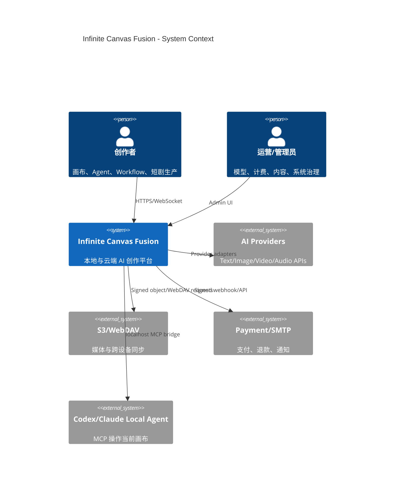
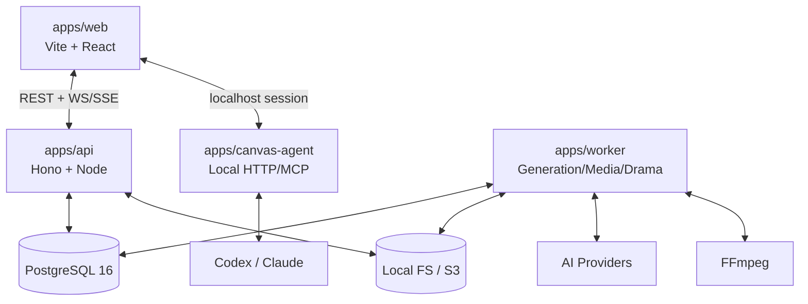
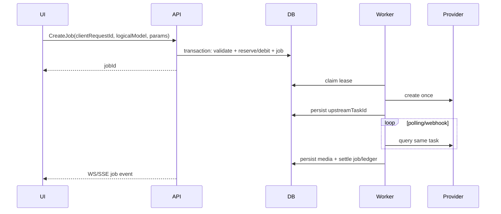

# Infinite Canvas Fusion 产品架构方案

> 状态：Implementation Complete / Runtime Validation Active（R0 complete；R1–R4 已落地，外部 Provider、基础设施与桌面媒体工具链验收仍在进行）
> 基线：`infinite-canvas@ed013e8`、`z3cz@31542084`、`VOZEB-PRO@f216abf`  
> 日期：2026-08-27  
> 决策：以 infinite-canvas 为地基；用户已确认持有 VOZEB-PRO 授权，可直接参考并迁移实现逻辑。

## 1. 架构目标

打造一套同时支持个人本地创作与团队云端生产的 AI 多模态创作平台，覆盖：

- 无限画布、可执行 Workflow、Creative Studio、统一创作 Agent；
- 文本、图片、视频、音频生成与持久任务；
- 本地 Agent/MCP、Skills、插件节点；
- 素材库、短剧生产线、作品发布与社区；
- 多模型渠道、逻辑模型路由、积分计费、支付退款与运营后台；
- 离线单机、Docker 私有部署与可扩展云部署。

### 1.1 质量目标

| 维度     | 目标                                                                  |
| -------- | --------------------------------------------------------------------- |
| 兼容性   | infinite-canvas `version: 3` 项目无损导入；未知插件节点可 round-trip  |
| 可靠性   | 已受理生成任务刷新页面/重启实例后继续；重复请求不重复调用上游或扣费   |
| 安全性   | Server mode 密钥永不下发浏览器；远程插件不在主 Window Realm 执行      |
| 可部署性 | 单机 Docker Compose 为第一优先；云平台能力均位于 adapter 后           |
| 可扩展性 | 新模型、新节点、新存储、新支付渠道通过稳定 contract 接入              |
| 可测试性 | domain state machine、migration、权限、计费与任务恢复必须有自动化测试 |

### 1.2 非目标

- 不把三套 UI 逐页拼接成巨型 SPA。
- 不让 Canvas 的视觉连线自动等同可执行 DAG。
- 不在第一阶段引入微服务、Kafka、Redis 等非必要基础设施。
- 不为迁就 Cloudflare 而牺牲自托管 Node/PostgreSQL 主路径。

## 2. 核心架构决策

### ADR-001：保留 Vite React 前端，服务端独立化

- `infinite-canvas/web` 保持 Vite + React 19 地基，逐步迁入 pnpm workspace。
- 新建 Hono TypeScript API；Node 运行时为标准实现，Cloudflare 为可选 adapter。
- VOZEB Next.js Route Handler 中的业务逻辑迁入 domain/service/repository，不直接复制页面路由耦合。

### ADR-002：模块化单体 + 独立 Worker

第一阶段采用三进程：`web`、`api`、`worker`。API 内部按领域模块化，共用 PostgreSQL；生成和媒体持久化由 Worker 执行。达到明确独立扩缩容需求后才拆服务。

### ADR-003：Local-first 与 Server Workspace 双模式

- **Local mode**：画布、素材、配置保存在 localForage；用户可直连自有模型与 WebDAV。
- **Server mode**：账号、团队、协作、服务端密钥、持久任务、计费和治理启用。
- 同一 `CanvasDocument` contract，不维护两套 UI；通过 repository/provider adapter 切换。

### ADR-004：Canvas 与 Workflow 分离，通过 Compile 连接

- `CanvasDocument` 是自由布局创作数据，可包含注释、未连接节点、视觉连接。
- `WorkflowDefinition` 是强类型可执行图，必须通过 schema、port、cycle、credential 校验。
- 用户显式“发布为 Workflow”，编译器输出 definition、warning/error 和 source mapping。

### ADR-005：PostgreSQL 同时承载事务数据与任务租约

复用 VOZEB 的 transaction/lease/heartbeat 和 z3cz 的 durable execution 思路，使用 `FOR UPDATE SKIP LOCKED` 认领任务。初期不引入独立 MQ；事件通知使用 WebSocket/SSE，Outbox 保证提交后投递。

### ADR-006：媒体为不可变 Asset，业务只保存引用

Blob 落 localForage、本地文件或 S3-compatible storage；业务记录只保存 `AssetRef`。去重以 content hash 为辅，访问使用鉴权 API/短期 signed URL，删除必须通过引用保护。

### ADR-007：插件采用 Capability Sandbox

远程插件必须包含 manifest、版本、integrity/signature、权限声明；默认在 sandboxed iframe/Worker 中运行，通过 message RPC 调用 host capability。可信内置插件可编译入主包，但仍遵循相同 API。

## 3. 系统上下文



## 4. 容器架构



### 4.1 目标仓库结构

```text
apps/
  web/                 infinite-canvas UI 地基
  api/                 HTTP、WebSocket、鉴权、领域 application services
  worker/              任务认领、上游轮询、媒体持久化、短剧合成
  canvas-agent/        由 infinite-canvas/canvas-agent 迁入
  docs/                产品和运维文档
packages/
  contracts/           跨端 DTO、events、schema、错误码
  canvas-core/         Canvas reducer、geometry、migration、compiler
  plugin-sdk/          manifest、capability、RPC、sandbox host
  workflow-runtime/    DAG validate/schedule/execute/resume
  model-gateway/       channel/protocol/logical model/provider adapter
  media/               AssetRef、blob store、signed access、variant
  auth/                session、RBAC、MFA、encryption primitives
  database/            schema、migration、repositories、outbox
  ui/                  共享设计 tokens/基础组件，禁止放领域状态
infra/
  docker/              Compose、Nginx/Caddy、healthcheck
  scripts/             install、backup、restore、release checks
```

## 5. 前端组件边界

| Surface         | 职责                                     | 状态来源                        |
| --------------- | ---------------------------------------- | ------------------------------- |
| Canvas Shell    | 节点编辑、连线、图片编辑、插件节点       | Canvas repository + UI store    |
| Workflow View   | typed ports、校验、执行、timeline        | Workflow API + execution events |
| Creative Studio | 按媒体/版本浏览同一项目成果              | Assets + node output projection |
| Agent Panel     | 对话、Skill、planning、结构化 operations | Agent run/events                |
| Drama Studio    | 剧本、角色、场景、分镜、配音、字幕、合成 | Drama domain APIs               |
| Library         | 素材、提示词、生成历史、版本             | Asset/Prompt services           |
| Community       | 草稿、审核、发布、互动                   | Publication/Governance services |
| Admin           | 用户、模型、任务、财务、内容、审计       | Admin-scoped APIs               |

前端组件禁止直接访问数据库、支付接口或 Server mode 上游模型。所有 Canvas 写入统一转换为 `CanvasOperation[]`，UI、Agent、插件和协作不得绕过 reducer。

Creative Studio 的实现遵守以下 projection contract：`CanvasProject` 始终是项目数据唯一真源，Studio 只读投影节点的文本、图片、视频和音频输出，不维护第二份可写项目状态；Workspace Asset 与 Generation Job AssetRef 作为带 `workspace_asset` / `generation_job` 来源标记的补充成果展示，不推断其归属当前 Project。Canvas 与 Studio 通过同一 Project ID 切换，返回 Canvas 时可用 `focusNode` 定位来源节点，因此切换视图不会改变节点、连线或 revision。

协作 presence 遵守 ephemeral contract：光标使用 Canvas world coordinates，选区只传 node ID；二者仅由 WebSocket room 广播并保存在浏览器内存 store，不进入 Canvas document、mutation、IndexedDB 或 PostgreSQL。客户端将发送频率限制在 20Hz，服务端继续执行 payload schema、16KiB 消息上限和 30 msg/s 限流；断线、切换 Workspace、Project 删除与 bridge 卸载必须同步清空在线成员，禁止显示幽灵 presence。

Canvas 写能力按 Workspace role fail-closed：Local mode 与 `owner/admin/editor` 可写，Server mode 的 `viewer` 只能读取、选择、复制、缩放、平移和播放媒体。viewer 的节点/连线 state setter、写快捷键、Workflow 发布、上传/生成 UI、Agent operations 与 Plugin write/AI capability 均在浏览器能力边界阻断；API 仍须在锁定 Project 的同一事务内校验至少 `editor`，整批 operations 未授权时不得应用任一 patch 或增加 revision。

离线 Canvas 修改采用 IndexedDB write-ahead operation queue：每条记录保存 stable `mutationId`、base revision、base/local document 与 granular operations，请求前必须先落盘。重连先按原 mutationId 重放以确认结果不明的已提交事务；收到 revision conflict 后，以 base/local/remote 对 touched node、connection 和 document field 做三方检查，仅不相交修改允许更新 baseRevision 后自动 rebase，相交修改保留本地与远端证据进入人工裁决。队列按 Workspace 隔离，浏览器 `online` 事件触发恢复，禁止用启动前的 stale remote snapshot 覆盖仍在队列中的本地版本。

人工冲突裁决提供三种显式结果：`accept_remote` 删除 pending mutation 并恢复远端；`keep_local_copy` 恢复远端原 Project，同时把本地内容赋予新 ID、revision 0 后作为独立 Project 同步；`retry_rebase` 重新读取最新远端并再次执行安全合并检查。任何路径都不得无提示覆盖本地内容，仍相交的 retry 必须继续保持 conflict。

离线队列同时记录 `mutation/create/delete` discriminated commands。新建以稳定 Project ID 识别未知提交结果；删除重放遇到 `PROJECT_NOT_FOUND` 视为终态成功。unknown-outcome command 的 payload 禁止被后续编辑改写，后续内容保留在 Workspace Canvas cache，前一 command 确认后再派生新 mutation。队列 read-modify-write 使用 Web Locks 跨标签串行化，不支持 Web Locks 时降级为当前标签 Promise chain；服务端 revision 与 mutationId 幂等仍是跨标签最终一致性边界。

Project checkpoint 是聚合的 immutable read model：创建时在锁定 Project 的同一事务内复制 canonical `CanvasDocument`，记录 `sourceRevision/name/description/createdBy/createdAt`。viewer 可读取和预览，只有 editor+ 可创建、删除或恢复。恢复必须携带 `expectedRevision`，在 Project row lock 内把 checkpoint snapshot 写成 `currentRevision + 1` 的新 canonical revision，并同步 Asset references 与 WebSocket canonical snapshot；禁止覆写 checkpoint、倒退 revision 或静默覆盖并发修改。Project 删除时 checkpoint 级联删除。

本地 Claude adapter 使用官方 Claude Agent SDK typed async iterator，不再直接 spawn CLI 或手工解析 JSONL；仅自动允许 Canvas MCP tools，继承 user/project/local settings，stderr 经统一脱敏后进入 Agent 事件协议。

## 6. 领域模块

### 6.1 Identity & Workspace

用户、Session、MFA、组织、成员、角色、邀请、账户注销。RBAC 至少包含 `owner/admin/editor/viewer/operator`；资源鉴权必须同时校验 tenant 与 resource ownership。

### 6.2 Canvas

核心聚合：`Project -> CanvasDocument -> Node/Connection/AssistantSession`。保存采用 snapshot + patch log，`mutationId` 幂等，`baseRevision` 乐观并发。local repository 与 cloud repository 实现同一接口。

版本面由 `ProjectCheckpoint` 提供命名快照与审计元数据，但不成为第二个可写 Project；restore 是 Project 上的显式 revision transition。

### 6.3 Workflow

核心聚合：`WorkflowDefinition -> Execution -> NodeExecution -> Event`。Runtime 负责拓扑分层、typed value 传递、step retry、sleep/event wait、cancel、resume。Cloudflare durable step 仅为 adapter。

### 6.4 Creative Runtime & Agent

统一文本/媒体创作会话，Agent Run 执行 planning、Skill policy、tool call、generation subtask 和 Canvas operations。内部 planning rationale 不进入面向用户的生成对话历史。

远端团队 Agent 由 Worker adapter 通过带 Bearer Token 的 HTTPS 协议接入，与 Local Canvas Agent 共用版本化 `canvas_get_state` / `canvas_apply_ops` JSON contract。远端只能获得 Run 所属 Workspace 的最小 Canvas/Asset 上下文；写操作回到 API 的 lease、RBAC、revision、idempotency、approval、audit 与 collaboration broadcast 边界执行，不向远端下放数据库或 Workspace credential。

### 6.5 Model Gateway

采用 VOZEB 的分层：

```text
Protocol -> Channel(credentials/baseUrl) -> Upstream Model
         -> Logical Model(capability/defaults/pricing)
         -> Candidate priority/fallback
```

Provider adapter 负责 request/response normalization；model router 只决策，不执行网络；billing model 与 routing model 分离。

### 6.6 Generation Job

```text
queued -> claimed -> submitting -> submitted -> polling
       -> result_ready -> persisting -> succeeded
       -> failed | cancel_requested -> cancelled | needs_review
```

- `clientRequestId` 防止重复创建；上游创建成功后固定 `upstreamTaskId`。
- Poll 只能查询同一任务；明确失败且用户主动 retry 才创建新 attempt。
- Worker 使用 lease/heartbeat；崩溃后可回收，终态和退款幂等。

### 6.7 Media & Asset

`Asset` 保存 owner、hash、mime、bytes、dimensions、duration、provider、storageKey、source、status。预览 variant 与原件分离；引用来自 Canvas、消息、任务、短剧、作品。删除先做引用图检查，后台 GC 只清理无引用且超过 retention 的对象。

浏览器上传入口在读取 request body 时执行硬大小上限，随后以 magic bytes 判定真实媒体类型；不得信任客户端 MIME、文件名或 object key。服务端生成不可变 key，并按 Workspace + SHA-256 去重。Local FS 必须做路径收敛，S3 读取使用短期 signed URL；数据库删除先于 Blob 删除，使失败最多形成可 GC 的 orphan，而不形成指向缺失 Blob 的记录。

### 6.8 Billing & Commerce

钱包/积分流水为 ledger，不直接覆写余额；扣费、任务创建、流水写入同一事务。商品、套餐、促销、优惠券、CDK、邀请、订单、支付、退款、对账均通过状态机与 webhook idempotency key 保护。

商品价格使用整数最小货币单位，促销按服务端时间窗计算。免费额度以 `(product,user)` 唯一授权并与钱包、ledger 原子入账。优惠券/CDK/邀请码仅在创建响应暴露一次明文，持久层只保存带独立部署密钥的 HMAC-SHA256；兑换与邀请关系以数据库唯一约束、行锁和幂等键抵御并发重复领取，自邀与一人多邀请关系被领域规则拒绝。

支付渠道通过 `PaymentAdapter` 隔离。订单固化下单时价格与积分并按 payload hash 幂等，支付成功事件、钱包入账、ledger 与订单终态同事务；webhook 对原始 body 做 HMAC、常量时间比较、时间窗和 provider event ID 去重。退款采用 durable intent + provider 调用 + 本地补偿状态，渠道已退款但积分不足时进入 `needs_review`，绝不生成负钱包。对账保存逐笔匹配证据，财务报告分别统计毛收入、退款、售出积分与模型实际成本。

### 6.9 Drama Production

独立 domain module：剧本版本、分析任务、角色/场景/道具、分镜、镜头媒体、配音、字幕、时间线、合成版本。它引用通用 Asset/Generation Job/Model Gateway，不侵入 Canvas core。

### 6.10 Publication & Governance

作品草稿、版本、审核、发布、下架、重发、点赞、关注、作者页与举报。发布快照不可随源项目变化；治理操作全量写 audit log。

### 6.11 Admin Control Plane

管理后台是独立领域模块和 Web route，不把控制面逻辑散落到各业务页面。浏览器使用 HttpOnly Session，并在每次请求校验用户仍为 `active/admin`；Maintenance Token 只作为隔离的 break-glass 入口。Dashboard 聚合用户、任务、模型健康、资产、积分、订单和治理数据。用户停用与 Session 撤销、任务恢复/取消、设置和运营内容变更必须与不可变 Audit Ledger 同事务。

平台设置按 allowlist 做类型与范围验证并使用 revision 防并发覆盖。Secret 使用 AES-256-GCM + setting-specific AAD，API 只返回配置状态。失败任务恢复创建新 attempt 并重新原子预留积分；仍持有 reserve 的 `needs_review` 才可原地恢复，禁止以已退款 attempt 免费重跑。

Admin Web 通过同一控制面编排 Model Gateway、Discovery、Commerce 与 Payment：模型渠道按协议→渠道/Secret→连接测试→模型同步→逻辑模型绑定五步配置；商业运营覆盖套餐、促销、优惠券/CDK、订单、退款、对账和财务统计。桥接层不复制领域数据，所有写操作仍落到原领域 Service/Repository，并追加不含 Secret 的管理员审计事件。

管理员控制面强制 Session 级 TOTP MFA assurance。TOTP seed 使用独立 AES-256-GCM master key 和 user-specific AAD，HMAC-SHA256 counter 在数据库中单调推进以拒绝并发重放；恢复码以独立 pepper 做 keyed hash 并仅能原子消费一次。Worker/Maintenance Token 轮换允许带明确过期时间的 previous token，过期或跨权限复用会阻断启动。

## 7. 关键数据契约

```ts
type CanvasDocument = {
  id: string;
  schemaVersion: number;
  revision: number;
  viewport: Viewport;
  nodes: CanvasNode[];
  connections: CanvasConnection[];
  assistantSessions: AssistantSession[];
  updatedAt: string;
};

type CanvasNode = {
  id: string;
  kind: string;
  schemaVersion: number;
  position: Position;
  size: Size;
  data: unknown;
  ports?: Port[];
  pluginRef?: { id: string; version: string };
};

type AssetRef = {
  assetId: string;
  variant?: "original" | "preview" | string;
  mimeType?: string;
  width?: number;
  height?: number;
  durationMs?: number;
};

type CanvasMutation = {
  mutationId: string;
  projectId: string;
  baseRevision: number;
  operations: CanvasOperation[];
  clientId: string;
  createdAt: string;
};
```

所有跨进程 contract 使用 Zod/JSON Schema 验证；数据库 entity 不直接作为 API DTO 返回。

## 8. 核心链路

### 8.1 生成与计费



### 8.2 协同编辑

客户端提交 `baseRevision + mutationId + operations`；服务器鉴权后通过纯 reducer 应用，原子递增 revision，广播 canonical patch。revision 不匹配返回 conflict snapshot/patch range，客户端 rebase；禁止 last-write-wins 静默覆盖。

### 8.3 Canvas Agent

本地 Agent 只获得当前 tab 签发的短期 session capability。Tool 先生成结构化 operation proposal；涉及删除、批量生成、外部网络或付费任务时要求 approval；应用后写 operation audit。

Skill 远程安装采用强制两阶段协议：`preview` 仅接受无凭据、无 query/fragment 的 GitHub HTTPS tree/blob URL，通过 GitHub API 将 ref 固定到 commit SHA，并列出所有文件的大小与 SHA-256、声明权限和静态推断证据；`install` 必须回传同一 digest 并逐项确认权限。preview 有十分钟 TTL 且只能消费一次，拒绝 redirect、路径穿越、symlink、submodule、超限文件和无效 `SKILL.md`。安装不执行远程脚本，完整文件树经临时目录和 atomic rename 写入 `.agents/skills`，同时保存来源、commit、digest 与权限 provenance；同名 Skill fail-closed，不覆盖本地版本。

## 9. API 与事件规范

- REST 前缀：`/api/v1`；资源名复数；cursor pagination。
- 响应：`{ data, meta?, requestId }`；错误：`{ error: { code, message, details? }, requestId }`。
- 写操作支持 `Idempotency-Key`；所有时间 ISO-8601 UTC；金额/积分使用整数最小单位。
- WebSocket 只承载协作；长任务状态优先 SSE，必要时统一 Event Gateway。
- 事件 envelope：`eventId/type/aggregateId/aggregateVersion/occurredAt/tenantId/payload`。
- webhook 必须校验签名、时间窗并按 provider event id 去重。

## 10. 安全架构

- 密钥：process env 或加密数据库；master key 与 ciphertext 分离；日志永不输出 secret。
- Web：HttpOnly/Secure/SameSite Session cookie、CSRF/Origin 校验、CSP、上传类型和大小双检。
- 权限：API、WebSocket、媒体签名、Worker internal endpoint 分别鉴权，禁止只依赖前端菜单隐藏。
- 插件：sandbox、权限清单、域名 allowlist、资源配额、签名与撤销列表；禁用 `Blob import` 主域执行。
- Agent：短期 capability token、工具 allowlist、用户 approval、操作审计、tab/session 隔离。Web 到 Local Agent 的 REST、SSE 与受保护媒体统一使用 `x-canvas-agent-token` Header；禁止把主 token 写入 query、媒体 URL、日志或错误遥测。原生 `EventSource` 不支持自定义 Header，因此 Web 使用 fetch-based SSE，并对断线重连、Abort 及服务端提供 event id 时的 `Last-Event-ID` 游标负责；历史媒体先鉴权 fetch，再以可回收 Blob URL 渲染。
- 数据：tenant ownership、参数化 SQL、备份加密、导出脱敏、注销与 retention policy。
- 供应链：lockfile、license inventory、secret scan、SBOM、镜像签名；保存 VOZEB 授权凭证与再分发条款。

## 11. 部署拓扑

### 11.1 标准自托管

`Caddy/Nginx + web + api + worker + PostgreSQL + local volume`，S3、SMTP、支付均可选。Compose 提供 install migration、healthcheck、backup/restore 和 rolling-safe migration。

### 11.2 扩展部署

- Web 静态 CDN；API 多副本无状态；Worker 按任务类型扩展。
- PostgreSQL 为 source of truth；对象存储独立扩展。
- WebSocket session 初期按 project consistent hashing/sticky session；规模增长后改为 shared session adapter。

## 12. 可观测性与灾备

- 结构化日志统一 `requestId/userId/tenantId/jobId/provider/attempt`，敏感字段脱敏。
- 指标：请求延迟/错误率、job queue age、lease recovery、provider success/cost、storage、WS connections、billing mismatch。
- Tracing 贯穿 UI request → API → Worker → Provider。
- PostgreSQL 定期全量 + WAL/PITR；媒体 bucket versioning/生命周期；提供脱敏业务导入导出。
- RPO/RTO 初始目标：RPO ≤ 24h、RTO ≤ 4h；生产商业版逐步收紧。

## 13. 测试与质量门禁

| 层级        | 必测内容                                                              |
| ----------- | --------------------------------------------------------------------- |
| Contract    | schema migration、DTO、provider normalization、plugin RPC             |
| Unit        | reducer、router、pricing、job state、refund、RBAC、DAG validator      |
| Integration | Postgres transaction/lease、object store、WebSocket conflict、webhook |
| E2E         | local canvas、云项目、生成恢复、Agent operation、短剧链路、支付退款   |
| Security    | plugin escape、IDOR、SSRF、upload、secret exposure、webhook replay    |

PR 门禁：format、lint、typecheck、unit/integration tests、production build、license/secret scan。数据库 migration 必须 forward-only，并附 rollback/compatibility 说明。

## 14. 迁移路线

1. **Foundation**：pnpm workspace、contracts、Canvas reducer、schema migration、测试基线。
2. **Security**：插件 sandbox、secret boundary、Agent capability。
3. **Cloud Workspace**：API、auth/RBAC、Postgres、S3、project patch/revision、WebSocket。
4. **Generation Platform**：迁移 VOZEB model gateway、task store/scheduler、媒体与计费；吸收 z3cz job persistence。
5. **Workflow & Studio**：移植 z3cz typed runtime、执行事件与双视图。
6. **Unified Agent**：迁移 VOZEB creative runtime/Agent run，与本地 Canvas Agent 汇合。
7. **Drama/Community/Commerce**：按独立领域逐一迁移 VOZEB 能力。
8. **Hardening**：灾备、审计、性能、发布与兼容验证。

每一步保持可运行、可回滚；禁止跨阶段大爆炸 merge。

## 15. 实施前必须归档的决策

- VOZEB 授权凭证、可修改/再分发/开源的具体条款与署名要求。
- 产品正式名称、品牌资产和默认许可证。
- Local mode 是否保留浏览器直连 Provider；默认应优先 Server mode。
- 首发支付渠道、对象存储和部署平台范围。
- 第一期是否包含短剧与社区；技术上建议 Foundation/Generation 完成后再启用。

## R3 Drama Production 基座（2026-08-28）

已实现 DRM-001～DRM-004 的后端领域边界：`drama_projects` 聚合以 revision + mutationId 提供乐观并发与幂等；剧本与镜头版本不可变；角色/场景/道具及来源媒体使用 Workspace 复合外键隔离。API 只允许 editor 写入、viewer 读取，所有 Asset 在 Service 与数据库双层校验同 Workspace。后续 DRM-005～010 在该聚合上接入生成、音轨、合成、导出与审批。

### R3 媒体生产增量（2026-08-28）

DRM-005/006/010 后端基座复用统一 Generation Job、Wallet 与 Asset：镜头生成任务使用稳定 clientRequestId 防重复计费，结果选择、对白/配音/BGM/字幕时间轴与镜头审核共用 Drama revision/mutationId 并发边界。跨 Workspace Asset 在 Service 与复合外键双重拒绝。FFmpeg 合成、剪映导出及 Canvas 双向发送继续作为 DRM-007～009 独立执行链落地。

### DRM-007/008 Worker（2026-08-28）

Render Worker 已接入独立租约循环。输入/输出 API 均校验 Worker token、活跃 lease 与任务素材白名单；FFmpeg 通过无 shell argv 执行并支持 abort 清理；剪映导出通过 MIT `jsjianyingdraft` 消费不可变 material manifest，生成 v5/v6 video/audio/subtitle 轨道与本地化素材 ZIP。成功上传后才允许创建不可变成片版本，失败进入可重试终态。

### DRM-009 双向互通（2026-08-28）

Drama 可将来源、实体参考、镜头选择、时间轴或成片 Asset 投递为 Canvas media node；Canvas 中绑定云端 assetId 的节点可反向导入 Drama 实体或时间轴，Asset Library 亦可直接导入。所有路径强制同 Workspace、目标 revision、mutationId 与 payload hash，Canvas Asset reference 会阻止仍在画布使用的素材被删除。

### Drama Studio Web 产品面（2026-08-28）

`/drama` 与 `/drama/:id` 是 Drama domain 的 Server-mode 产品入口。Web 仅通过 `CloudPlatformClient` 的 typed contract 调用领域 API，不在浏览器复制状态机；每次写操作携带当前 project revision 与随机 mutationId，成功后并行重取 project、production、render 三个 read model。工作台按剧本、实体、分镜、生成、时间轴、审批、交付与互通拆分视图，并以统一 Generation Job billing 汇总镜头成本。FFmpeg/剪映只创建 durable render job，浏览器不直接执行媒体工具链；产物始终通过受鉴权 Asset 下载接口读取。

剧本 AI 分析不接受客户端伪造的 analysis 作为任务完成证据：Drama 创建 capability=`text` 的统一 Generation Job，并在 immutable input 中固化 project、script version 与 source hash。成功结果只有通过严格 JSON schema、Workspace ACL、来源 hash 和当前 revision 校验后，才能由 editor 人工应用为新的不可变 Script Version；原版本永不覆盖。分析任务在 Drama 范围内按 Workspace 对成员可见，普通 Generation API 仍保持 owner 隔离。

Drama Studio 的所有可见文案集中在 `web/src/i18n/locales/drama.ts`，中文与英文词典 key 强制对称；页面不得保留中文 string literal。语言切换沿用全局 i18next subscription，无需重新加载项目或重建生产状态。

## R3 Community COM-001～005（2026-08-28）

作品社区采用独立 Publication aggregate：草稿关联同 Workspace Canvas，提交时冻结完整 document snapshot，审核通过复制为不可变发布版本。公开 Feed/Search/Tag/Cursor、详情、分享链接与作者页无需 Session；草稿、点赞、关注、举报要求登录。审核、驳回、下架、恢复由 Maintenance 边界执行并记录 requestId 幂等 audit trail；互动使用唯一约束保证计数一致。

### COM-006 社交层（2026-08-28）

评论支持回复、游标读取、幂等创建、举报、隐藏与恢复；隐藏内容不会出现在公开 API。收藏采用唯一集合语义并实时计数。合集采用 owner revision + mutationId/request hash，支持公开/非公开可见性、作品增删和显式排序。评论、举报、收藏均配置分钟级反滥用限制，治理操作进入 audit trail。

## Provider-specific Runtime（2026-08-28）

Model Protocol 除 OpenAI-compatible、Gemini 与声明式 Custom 外，新增独立 `seedance`、`stable-diffusion`、`media-kit` adapter。Worker 按 adapter 构造请求、轮询/取消并归一化媒体结果；Seedance 使用异步任务语义，Stable Diffusion 同时覆盖 A1111/Forge 的 txt2img 与 img2img，MediaKit 提供画质增强类 image/video capability。渠道凭据继续只在 Worker 租约执行期间解密，用户参数不能覆盖权威 upstream model，所有路径仍受 HTTPS/无凭据 URL/安全相对路径约束。

Volcengine adapter 使用 HMAC-SHA256 AK/SK 签名；AK 作为渠道标识保存在 config，SK 沿用 AES-GCM credential boundary。Worker 支持签名后的 submit/poll/cancel，Admin Maintenance API 支持模型、资源包与剩余额度三类查询，并复用 DNS 后内网阻断、禁止 redirect、30 秒 timeout 与 2MiB response ceiling。签名 Secret 不进入 URL、响应、审计 metadata 或日志。
